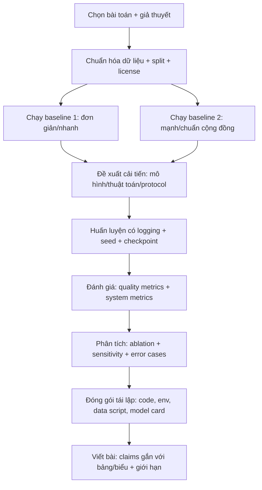
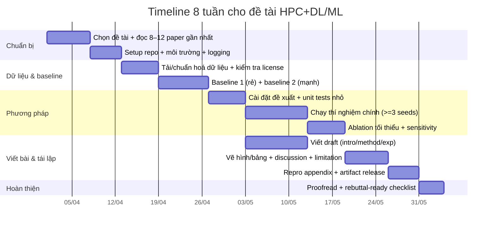

# Ứng dụng HPC thân thiện với sinh viên của DL/ML: 8 ý tưởng đề tài khả thi để viết bài hội nghị quốc tế

## Tóm tắt điều hành

Báo cáo này đề xuất 8 hướng nghiên cứu “HPC applications” của deep learning (DL) và machine learning (ML) **đủ mới – đủ nhỏ – đủ đo đạc được** để sinh viên có thể hoàn thành trong **6–8 tuần** và viết thành bài nộp hội nghị quốc tế. Điểm nhấn xuyên suốt là: (i) bài toán/ứng dụng mang tính “HPC” (mô phỏng khoa học, tối ưu kernel, huấn luyện phân tán, lập lịch cụm, suy luận lượng tử hoá…), (ii) thiết kế thí nghiệm có baseline mạnh + metric rõ + tái lập, và (iii) “tính toán rẻ” (miễn phí/giá thấp) với ước lượng GPU-giờ và chi phí minh bạch dựa trên nguồn chính thống.

Các nguồn dữ liệu và tài liệu chính được ưu tiên trong 5 năm gần đây gồm các benchmark/kho dữ liệu và bài gốc như **PDEBench (NeurIPS Datasets & Benchmarks 2022)** citeturn13view1, **LoveDA (NeurIPS DB 2021)** citeturn18view0turn2search19, hướng **Neural Operators** (JMLR 2023; DeepONet 2021) citeturn11search0turn11search2, **MetaSchedule** cho autotuning (NeurIPS 2022) citeturn0search3, các hướng **Distributed Training** (DDP/FSDP/ZeRO) citeturn3search1turn2search0turn2search1, **PBT/HPO** citeturn3search0turn3search16, và **Quantization** (LLM.int8, SmoothQuant) citeturn3search10turn3academia36.

**Lưu ý về giới hạn nền tảng rẻ:** bản miễn phí của Google Colab thường có phiên chạy tối đa khoảng 12 giờ và giới hạn tài nguyên thay đổi theo thời điểm/nhu cầu citeturn16view1; vì vậy kế hoạch trong báo cáo đều thiết kế theo “job ngắn, checkpoint thường xuyên, tái lập được”.

### Bảng so sánh nhanh các đề tài

Thang đánh giá gợi ý: **Độ mới** (1–5), **Độ khó** (1–5), **Compute** (GPU-giờ tổng cho bản tối thiểu), **Tác động kỳ vọng** (1–5, dựa trên tính “đo được”, khả năng generalize, và giá trị thực nghiệm/khuyến nghị).

| Mã | Ý tưởng nghiên cứu (tóm tắt) | HPC “đúng nghĩa” ở đâu | Độ mới | Độ khó | Compute tối thiểu | Tác động |
|---|---|---|---:|---:|---:|---:|
| T1 | Neural Operator đa tần cho surrogate PDE (PDEBench) | Thay thế/tăng tốc mô phỏng PDE, đo speed/accuracy trade-off | 4 | 4 | 8–16 GPUh | 5 |
| T2 | ML chọn preconditioner/solver cho hệ tuyến tính thưa (SuiteSparse) | Tăng tốc sparse linear algebra (xương sống HPC) | 4 | 3 | 0–4 GPUh (CPU chính) | 4 |
| T3 | Dự đoán runtime + lập lịch backfilling “uncertainty-aware” (PWA/JSSPP) | Tối ưu vận hành cụm HPC bằng mô phỏng lập lịch + metric chuẩn | 4 | 3 | 0–2 GPUh (CPU chính) | 4 |
| T4 | Auto-tuning kernel bằng entity["organization","Apache TVM","ml compiler project"] MetaSchedule + transfer | Tối ưu hiệu năng inference/ops (compiler-level) | 5 | 4 | 6–12 GPUh | 4 |
| T5 | Benchmark huấn luyện phân tán: entity["organization","PyTorch","deep learning framework"] DDP vs FSDP vs entity["organization","DeepSpeed","distributed training library"] ZeRO | Kỹ thuật sharding/offload giúp chạy mô hình lớn trên GPU rẻ | 3 | 4 | 8–20 GPUh (multi-GPU) | 4 |
| T6 | HPO theo ngân sách bằng entity["organization","Ray","distributed computing framework"] Tune PBT + cost-aware early stop | Tối ưu “best model per GPU-hour” (tư duy HPC: phân bổ tài nguyên) | 3 | 3 | 4–10 GPUh | 3 |
| T7 | Segmentation viễn thám (LoveDA) với LoRA/PEFT + pipeline tiling | Xử lý ảnh lớn (1024²) + giảm RAM/compute, hướng triển khai | 4 | 4 | 10–24 GPUh | 4 |
| T8 | Lượng tử hoá Transformer (INT8/W8A8) đo latency/memory/accuracy | Giảm chi phí suy luận quy mô lớn, đánh đổi chính xác–tốc độ | 3 | 2 | 1–4 GPUh | 3 |

Các ước lượng GPU-giờ ở trên được thiết kế để **khả thi trên GPU phổ thông** (T4/RTX-class) hoặc các GPU thuê rẻ theo giờ.

## Tiêu chí chọn đề tài và định nghĩa “HPC thân thiện với sinh viên”

Một đề tài DL/ML “đúng chất HPC” nhưng vẫn phù hợp sinh viên thường thỏa 5 tiêu chí:

**Tính HPC (measurable systems angle).** Phải đo được ít nhất 1 trong các trục: (a) thời gian chạy/throughput/latency, (b) memory footprint, (c) scaling efficiency (1→2 GPU hoặc CPU parallel), (d) cost per result (USD hoặc GPU-hour), (e) chất lượng dự báo thay mô phỏng khoa học. Ví dụ: PDEBench nhấn mạnh benchmark SciML với nhiều PDE và metric beyond RMSE citeturn13view1; MetaSchedule nhấn mạnh tìm chương trình tensor tốt bằng framework học-driven citeturn0search3.

**Tính mới với phạm vi nhỏ.** “Mới” không nhất thiết là kiến trúc hoàn toàn mới; có thể là: (i) biến thể loss/regularization có cơ sở, (ii) protocol đánh giá mới (ví dụ “accuracy per GPU-hour”), (iii) transfer/caching giúp giảm số phép đo autotune, (iv) uncertainty để ra quyết định lập lịch.

**Dữ liệu công khai + tái lập.** Ưu tiên dataset có DOI/kho chính thức: PDEBench trên entity["organization","DaRUS","data repository | stuttgart"] citeturn13view0, LoveDA trên entity["organization","Zenodo","open research repository"] citeturn18view0, traces HPC dạng SWF từ Parallel Workloads Archive citeturn0search2. Bài nộp hội nghị quốc tế thường cần tiếp cận dữ liệu rõ ràng và license minh bạch.

**Baseline mạnh + ablation tối thiểu.** Mỗi đề tài nên có ≥2 baseline (một “simple/cheap”, một “strong”) và ablation 1–2 yếu tố.

**Thiết kế theo ngân sách.** Mục tiêu là chạy được trên Colab/Kaggle/VM rẻ; notebook bị giới hạn thời gian nên cần checkpointing và chạy theo “job ngắn”. Colab nêu rõ chính sách giới hạn thay đổi và bản free có thể chạy tối đa khoảng 12 giờ citeturn16view1.

### Sơ đồ pipeline thí nghiệm chuẩn (tái dùng cho mọi đề tài)

## 8 ý tưởng đề tài nghiên cứu cụ thể

### T1 — Neural Operator đa tần cho surrogate PDE trên PDEBench

**Mục tiêu.** Cải thiện độ chính xác dự báo PDE (đặc biệt phổ tần cao) nhưng giữ inference nhanh, nhằm phục vụ surrogate modeling cho mô phỏng khoa học.

**Giả thuyết.** FNO có “low-frequency bias”; thêm nhánh đa tần (Fourier + local CNN/wavelet residual) và loss nhấn mạnh phổ cao sẽ giảm sai số phổ mà không tăng latency đáng kể. Bằng chứng nền: các phân tích gần đây về ưu/nhược FNO theo miền tần số citeturn11search11 và tổng quan Neural Operator (JMLR 2023) citeturn11search0.

**Mô hình/thuật toán cần dùng.**
- Baseline mạnh: Fourier Neural Operator (FNO) (ICLR 2021) citeturn11search9.
- Baseline rẻ: U-Net (được PDEBench dùng như baseline autoregressive) citeturn13view1.
- Đề xuất: “Multi-Frequency FNO” = FNO trunk + (i) local convolution residual, (ii) spectral loss (Fourier-domain MSE có trọng số theo tần số).

**Dataset (kích thước, truy cập).**
- PDEBench datasets trên entity["organization","DaRUS","data repository | stuttgart"] (DOI: 10.18419/DARUS-2986) citeturn13view0.
- Lưu ý thực tế: nhiều file train có kích thước cỡ **7.7 GB mỗi file** (ví dụ 1D Advection/Burgers train) và kho khuyến cáo “chọn file cần” vì dataset rất lớn citeturn13view0. Vì vậy phương án sinh viên nên:
  - Chọn 1 PDE “nhẹ” (1D Burgers hoặc 2D diffusion-reaction).
  - **Tạo subset** bằng cách lấy ít samples/time-steps hoặc dùng code của PDEBench để sinh dữ liệu nhỏ hơn (repo cung cấp script chạy forward/inverse) citeturn15search2.
- Tham chiếu mô tả benchmark + metric của PDEBench: citeturn13view1.

**Thiết kế thí nghiệm.**
- Task: dự báo rollout T bước (autoregressive hoặc one-shot) trên 1 PDE.
- Split: train/val/test theo tham số PDE (để kiểm tra generalization theo regime).
- So sánh:
  1) U-Net autoregressive,
  2) FNO chuẩn,
  3) Multi-Frequency FNO (đề xuất).
- Ablation tối thiểu: (a) có/không spectral loss, (b) có/không local residual branch.

**Metric đánh giá.**
- Quality: RMSE, relative L2; thêm spectral error (trên FFT) để phản ánh phổ cao.
- System: latency inference (ms/sample), throughput (samples/s) và memory peak.
- Nếu có: metric “physics-aware” theo PDEBench (PDEBench đề xuất mở rộng metric hơn RMSE) citeturn13view1.

**Kết quả kỳ vọng.**
- Giảm spectral error vùng high-frequency rõ rệt so với FNO chuẩn; giữ RMSE tổng tương đương hoặc tốt hơn.
- Latency tăng nhỏ (≤10–20%) do thêm nhánh nhẹ.

**Ước lượng compute/time (tối thiểu).**
- Miễn phí (Colab/Kaggle): 2–3 lần chạy mô hình, mỗi lần 2–6 giờ GPU tùy độ phân giải; cần checkpoint vì phiên có thể giới hạn thời gian citeturn16view1.
- Thuê GPU rẻ: theo bảng giá entity["company","Runpod","gpu cloud platform"], RTX A5000 (24GB) có thể khoảng **$0.16/giờ** citeturn5view1 → 12 GPUh ≈ $1.9.

**Kế hoạch thí nghiệm tối thiểu (reproducible, step-by-step).**
1) Fork repo PDEBench, chạy pipeline tối thiểu (forward) theo hướng dẫn script citeturn15search2.
2) Chuẩn hoá loader (HDF5 → torch Dataset), hỗ trợ chọn subset N samples + downsample grid.
3) Huấn luyện U-Net baseline 20–50 epochs nhỏ; lưu checkpoint + config (YAML).
4) Huấn luyện FNO baseline cùng budget epoch/GPUh.
5) Cài đặt Multi-Frequency FNO: thêm residual CNN + spectral loss; train.
6) Log đầy đủ: seed, commit hash, hyperparams, GPU type.
7) Evaluation: RMSE/rel-L2 + spectral error; benchmark inference latency (torch.cuda.Event).
8) Xuất artifacts: bảng kết quả + biểu đồ error theo tần số; script tái lập 1-click.

**Software stack yêu cầu.**
- Python 3.10+, PyTorch, h5py, numpy; optional: lightning/wandb.
- CUDA runtime theo GPU.

**Ngân sách (tối thiểu).**
- Compute: $0 (miễn phí) hoặc ~$2–$5 nếu thuê GPU vài chục giờ (tùy số chạy).
- Storage: 2–15GB (subset) hoặc >8GB nếu tải 1 file train citeturn13view0.
- Data access: miễn phí (CC BY 4.0 cho dataset PDEBench) citeturn13view0.

**Tham khảo mẫu (1–2 nguồn).**
- PDEBench benchmark/datasets: citeturn13view1turn13view0.
- Neural Operator (JMLR 2023) và/hoặc FNO ICLR 2021: citeturn11search0turn11search9.

---

### T2 — ML chọn preconditioner/solver cho hệ tuyến tính thưa từ SuiteSparse

**Mục tiêu.** Dự đoán nhanh “solver–preconditioner pair” tốt (ít thời gian giải nhất) cho một ma trận thưa, thay vì phải thử nhiều cấu hình. Đây là “HPC core” vì sparse linear systems xuất hiện khắp mô phỏng khoa học.

**Giả thuyết.** Đặc trưng đồ thị của ma trận thưa + embedding từ GNN có thể dự đoán preconditioner tốt hơn heuristic dựa trên kích thước/nnz, giảm “regret” so với lựa chọn ngẫu nhiên/heuristic.

**Mô hình/thuật toán cần dùng.**
- Baseline rẻ: model tabular (XGBoost/LightGBM hoặc logistic regression) trên features thủ công: n, nnz, symmetry, diagonal dominance…
- Baseline mạnh: GNN (GraphSAGE/GCN) trên đồ thị adjacency.
- Nhãn (label): argmin thời gian giải trong tập {Jacobi, ILU(k), AMG…} với solver CG/GMRES.

**Dataset (kích thước, truy cập).**
- SuiteSparse Matrix Collection (cổng chính) citeturn10search5.
- Tài liệu UFget (trợ tải) nêu tổng kích thước collection (các format) **>47GB** và tiếp tục tăng citeturn10search3. Vì vậy sinh viên nên:
  - Lấy **subset 200–800 ma trận** theo tiêu chí kích thước (n ≤ 50k; nnz ≤ vài triệu).
  - Ghi rõ danh sách matrix IDs để tái lập.
- Nếu cần API/metadata: có các interface/community tools; tối thiểu có thể tải từ trang SuiteSparse theo ID.

**Thiết kế thí nghiệm.**
- Bước 1 (data labeling): với mỗi ma trận, chạy solver+preconditioner và record:
  - thời gian factor/build preconditioner,
  - số iterations,
  - tổng thời gian solve.
- Bước 2 (train): dự đoán “best preconditioner” hoặc dự đoán thời gian solve cho mỗi option (learning-to-rank).
- Bước 3 (test): đo regret = time(chọn bởi model)/time(tối ưu).

**Metric đánh giá.**
- Classification: accuracy/top-2 accuracy của lựa chọn preconditioner.
- Decision quality: regret (median/95th percentile), speedup trung bình.
- HPC realism: tách build time vs solve time (quan trọng vì AMG/ILU có thể build đắt) — phù hợp với quan sát rằng ML-preconditioner có thể giúp cost xây dựng “dự đoán được” hơn trong các nghiên cứu gần đây citeturn10search4.

**Kết quả kỳ vọng.**
- GNN giảm regret đáng kể trên tập ma trận “khó” (ill-conditioned) so với heuristic.
- Điểm hội nghị: bạn có thể báo cáo “policy lựa chọn dựa trên ML” như một lớp “auto-tuner” cho solver stack.

**Ước lượng compute/time.**
- Chủ yếu CPU; có thể chạy trên Colab CPU hoặc VM miễn phí.
- Labeling 200–500 ma trận có thể mất vài giờ đến 1–2 ngày CPU (tuỳ giới hạn nnz). Khuyến nghị thiết kế “small-first”: chạy trên tập 100 ma trận để chốt pipeline.

**Kế hoạch thí nghiệm tối thiểu.**
1) Chọn subset SuiteSparse (lọc theo n, nnz).
2) Tải ma trận; chuyển về CSR (scipy.sparse).
3) Định nghĩa menu cấu hình: (solver CG/GMRES) × (Jacobi/ILU/AMG).
4) Benchmark từng cấu hình (time/perf counters).
5) Tạo dataset features + labels.
6) Train baseline tabular; evaluate regret.
7) Train GNN; evaluate.
8) Ablation: bỏ graph features hoặc chỉ dùng nnz/n để chứng minh đóng góp.

**Software stack yêu cầu.**
- Python, numpy/scipy; optional: pyamg (AMG), scikit-learn; GNN: PyTorch Geometric/DGL.

**Ngân sách.**
- Compute: $0 (CPU).
- Storage: vài trăm MB đến vài GB (tuỳ subset; không cần tải toàn bộ 47GB+) citeturn10search3.
- Data access: miễn phí.

**Tham khảo mẫu.**
- NeurIPS 2022: GNN cho lựa chọn preconditioner/solver (đặt baseline/related work) citeturn10search15.
- ICLR 2025: Graph Neural Preconditioners (đặt ngữ cảnh payoff của ML cho preconditioning) citeturn10search7.

---

### T3 — Dự đoán runtime + backfilling “uncertainty-aware” cho lập lịch cụm từ workload traces

**Mục tiêu.** Giảm thời gian chờ và bounded slowdown bằng cách cải thiện dự đoán runtime/walltime (kèm bất định) để backfilling hiệu quả hơn trên traces thực.

**Giả thuyết.** Runtime prediction với **quantile regression / conformal prediction** giúp lập lịch “bảo thủ có kiểm soát”, giảm penalty do dự đoán quá lạc quan, từ đó cải thiện bounded slowdown trong mô phỏng cụm.

**Mô hình/thuật toán cần dùng.**
- Baseline: dự đoán mean runtime (RandomForest/GBDT).
- Đề xuất: quantile regression (p50/p90) + policy chọn quantile theo tải hệ thống.
- Simulator: citeturn9search1 (AccaSim), hoặc mô phỏng đơn giản FCFS+backfill.

**Dataset (kích thước, truy cập).**
- Parallel Workloads Archive: logs ở dạng SWF (format chuẩn) citeturn0search2.
- Một nguồn “tươi” hơn từ cộng đồng lịch HPC: trang Workload Archive có log MetaCentrum (2023) gắn với paper 2024 citeturn9search26.
- Lưu ý: traces thường là text files, dung lượng nhỏ (MB–GB), phù hợp sinh viên.

**Thiết kế thí nghiệm.**
- Task A: dự đoán runtime từ meta job (requested processors, queue, user group…).
- Task B: mô phỏng scheduling:
  - FCFS không backfill,
  - EASY backfilling dùng user walltime,
  - EASY backfilling dùng runtime prediction (mean),
  - EASY backfilling dùng runtime prediction + uncertainty (p90/p95 adaptive).

**Metric đánh giá.**
- Pred quality: MAE/RMSE (log-runtime), pinball loss cho quantile.
- Scheduling: average bounded slowdown (metric hay dùng trong scheduling research; xuất hiện trong các paper lập lịch xanh/DRL gần đây) citeturn9search4, average wait time, starvation rate.

**Kết quả kỳ vọng.**
- Uncertainty-aware backfilling cải thiện bounded slowdown và ổn định hơn theo tải.
- Điểm hội nghị: “uncertainty as a control knob” + mô phỏng với traces thực.

**Ước lượng compute/time.**
- CPU là chính; có thể chạy trên VM miễn phí (Oracle/Google/Hetzner).
- Train GBDT vài phút; mô phỏng scheduling vài phút–vài giờ tuỳ số job.

**Kế hoạch thí nghiệm tối thiểu.**
1) Chọn 1–2 traces SWF từ PWA hoặc MetaCentrum.
2) Parse SWF; làm sạch (jobs lỗi, runtime=0).
3) Baseline prediction (GBDT).
4) Quantile prediction (p50/p90).
5) Implement EASY backfilling simulator (hoặc tích hợp AccaSim).
6) Chạy mô phỏng 4 policy ở trên; tính bounded slowdown/wait time.
7) Sensitivity: thay quantile theo load (ví dụ load>0.8 → dùng p95).
8) Báo cáo bảng trade-off: wait time vs utilization vs worst-case slowdown.

**Software stack yêu cầu.**
- Python, pandas, scikit-learn/lightgbm; simulator: AccaSim optional citeturn9search1.

**Ngân sách.**
- Compute: $0.
- Storage: <1GB.
- Data access: miễn phí nhưng cần tuân thủ điều khoản sử dụng log (PWA có data usage note).

**Tham khảo mẫu.**
- DRAS (2022) — DRL cho HPC scheduling (đặt related work) citeturn9search32.
- Paper 2025 về HRL scheduler (ngữ cảnh hiện đại) citeturn9search20.

---

### T4 — Auto-tuning kernel bằng MetaSchedule + transfer/warm-start để giảm số phép đo

**Mục tiêu.** Giảm số lần “measure” trong autotuning mà vẫn đạt latency gần tối ưu, thông qua transfer learning/warm-start từ tuning logs trước đó.

**Giả thuyết.** Một “cost model warm-start” hoặc “candidate reuse” dựa trên similarity có thể giúp MetaSchedule đạt performance tương đương với ít phép đo hơn (tức tiết kiệm GPU-giờ).

**Mô hình/thuật toán cần dùng.**
- Hệ thống nền: MetaSchedule (NeurIPS 2022) citeturn0search3 + API docs citeturn2search6.
- Baseline: quy trình “e2e optimize model via autotuning” của TVM citeturn15search7turn15search3.
- Đề xuất đơn giản nhưng mới:  
  - (A) Transfer: dùng logs từ GPU A để khởi tạo mẫu ứng viên cho GPU B,  
  - hoặc (B) Similarity: cluster các tasks theo feature và tái sử dụng top-k schedules.

**Dataset (kích thước, truy cập).**
- Dữ liệu chính là **tuning logs** bạn tự sinh (json/db), thường vài MB–GB.
- Tutorial end-to-end MetaSchedule có notebook chạy trên Colab (tái lập tốt) citeturn15search3turn15search7.

**Thiết kế thí nghiệm.**
- Chọn model nhỏ: ResNet-18 (đúng như tutorial) citeturn15search7.
- Chọn 2 điều kiện:
  - Budget đo nhỏ (ví dụ 200–500 measurements/task),
  - Budget đo lớn (baseline “gần tối ưu”).
- So sánh:
  1) MetaSchedule chuẩn (budget nhỏ),
  2) MetaSchedule chuẩn (budget lớn),
  3) MetaSchedule + warm-start (budget nhỏ).
- Đánh giá trên 1–2 GPU khác nhau nếu có.

**Metric đánh giá.**
- Latency inference (ms), throughput; % khoảng cách tới best-known.
- Tuning cost: số measurements, tổng thời gian tuning.
- Reproducibility: variance giữa 3 seeds (do stochastic search).

**Kết quả kỳ vọng.**
- Warm-start đạt 90–98% performance của budget lớn với chỉ 30–50% measurements.
- Paper có thể đóng góp “practical protocol” + open logs.

**Ước lượng compute/time.**
- Tuning tiêu tốn GPU; tối thiểu 6–12 GPUh cho 1 vòng (tuỳ budget/tasks).
- Nếu thuê GPU rẻ (RTX-class), chi phí nhỏ; nếu cần A100 thì đắt hơn (tham khảo giá A100 ~ $1.19/giờ trên entity["company","Runpod","gpu cloud platform"]) citeturn4view0.

**Kế hoạch thí nghiệm tối thiểu.**
1) Chạy notebook e2e_opt_model theo hướng dẫn citeturn15search3turn15search7 và lưu log baseline.
2) Cố định target (CUDA), cố định model, cố định batch size.
3) Thiết lập “budget nhỏ” và “budget lớn”.
4) Cài warm-start: load log cũ → lấy top-k schedules làm “seed candidates”.
5) Chạy tuning và inference benchmark (nhiều lần để lấy median).
6) Phân tích: performance vs measurements; vẽ đường cong.
7) Viết “repro script”: 1 lệnh chạy tuning, 1 lệnh chạy benchmark.

**Software stack yêu cầu.**
- TVM build/apt wheel theo hướng dẫn tutorial; Python; CUDA.
- Nên pin version (commit hash) vì stack compiler thay đổi.

**Ngân sách.**
- Compute: 6–12 GPUh (RTX A5000 ~$1–$2) hoặc A100 đắt hơn citeturn4view0.
- Storage: logs vài GB tối đa.
- Data access: miễn phí.

**Tham khảo mẫu.**
- MetaSchedule paper (NeurIPS 2022) citeturn0search3.
- TVM end-to-end optimize tutorial + Colab notebook citeturn15search7turn15search3.

---

### T5 — Benchmark huấn luyện phân tán trên GPU rẻ: DDP vs FSDP vs ZeRO-Offload/Infinity

**Mục tiêu.** Xây dựng benchmark tái lập để trả lời: “Với 1–2 GPU giá rẻ, phương pháp nào cho throughput và memory tốt nhất khi huấn luyện mô hình vừa/nhỉnh?”

**Giả thuyết.** Nếu mô hình vừa đủ lớn để sát giới hạn VRAM, FSDP/ZeRO-Offload giúp tăng batch size hoặc chạy được mô hình lớn hơn, nhưng có thể giảm throughput do communication/offload. PyTorch mô tả FSDP là wrapper shard parameters, lấy cảm hứng từ ZeRO Stage-3 citeturn2search0; còn ZeRO-Infinity dùng GPU+CPU+NVMe memory để phá “GPU memory wall” citeturn2search1.

**Mô hình/thuật toán cần dùng.**
- Data-parallel baseline: DDP citeturn3search1turn3search5.
- Sharded: FSDP citeturn2search0turn2search8.
- Offload/sharding: ZeRO (DeepSpeed) citeturn2search1turn2search5.
- Model: khuyến nghị 2 chế độ:
  1) “Accuracy mode”: ResNet-18 trên CIFAR-10 citeturn12search0,
  2) “Memory stress mode”: Transformer decoder cỡ vừa (synthetic) để đo max batch size.

**Dataset.**
- CIFAR-10: 60,000 ảnh 32×32; 50k train, 10k test citeturn12search0.

**Thiết kế thí nghiệm.**
- 1 GPU vs 2 GPU:
  - đo images/sec, step time, max batch size, peak VRAM.
- Các biến hệ thống:
  - mixed precision (fp16/bf16), gradient accumulation, activation checkpointing.
- So sánh 3 framework ở cùng target accuracy hoặc cùng số step.

**Metric đánh giá.**
- Throughput (images/sec), time-to-accuracy.
- Memory peak (GB).
- Scaling efficiency: throughput(2GPU)/(2×throughput(1GPU)).
- Cost metric: accuracy per GPU-hour (tuỳ chọn, liên kết T6).

**Kết quả kỳ vọng.**
- DDP thắng throughput khi mô hình “vừa VRAM”.
- FSDP/ZeRO giúp chạy mô hình/batch lớn hơn; trade-off throughput rõ ràng.
- Giá trị hội nghị: báo cáo “guidelines” tái lập cho nhóm nhỏ không có cluster.

**Ước lượng compute/time.**
- Tối thiểu: 3 cấu hình × (1GPU + 2GPU) × 1–2 giờ = 6–12 GPUh (không tính tuning).
- Nếu thuê GPU: dùng GPU giá rẻ theo giờ (tham khảo bảng giá RTX-class trên entity["company","Runpod","gpu cloud platform"]) citeturn5view1.

**Kế hoạch thí nghiệm tối thiểu.**
1) Viết training script CIFAR-10 (ResNet-18).
2) Bọc DDP (torchrun).
3) Bọc FSDP theo tutorial citeturn2search8turn2search0.
4) Cấu hình DeepSpeed ZeRO (stage 2/3) theo repo + ZeRO-Infinity paper backdrop citeturn2search5turn2search1.
5) Instrument đo throughput và memory (torch.cuda.max_memory_allocated).
6) Mỗi cấu hình chạy 3 lần (seed khác) để lấy median.
7) Xuất bảng kết quả + biểu đồ scaling.

**Software stack yêu cầu.**
- PyTorch + torch.distributed primitives citeturn3search25.
- DeepSpeed (pip, CUDA) citeturn2search5.

**Ngân sách.**
- Compute: 8–20 GPUh; với RTX A5000 $0.16/h → $1.3–$3.2 citeturn5view1.
- Storage: CIFAR-10 nhỏ (<1GB).
- Data access: miễn phí.

**Tham khảo mẫu.**
- DDP docs citeturn3search1 và FSDP docs citeturn2search0.
- ZeRO-Infinity (2021) citeturn2search1.

---

### T6 — HPO theo ngân sách: so sánh PBT với random/ASHA theo “best model per GPU-hour”

**Mục tiêu.** Chứng minh rằng HPO theo kiểu “population-based training” (PBT) tận dụng tài nguyên song song tốt hơn để đạt chất lượng cao trong cùng ngân sách.

**Giả thuyết.** PBT (vừa train vừa mutate hyperparameters) có thể đạt accuracy tốt hơn random search khi ngân sách bị giới hạn, vì nó “tái chế” checkpoint của trial tốt. Ray cung cấp guide PBT và mô tả cơ chế exploit/explore citeturn3search0. Các biến thể/khung tổng quát hoá (GPBT) xuất hiện gần đây citeturn3search16.

**Mô hình/thuật toán cần dùng.**
- HPO engine: Ray Tune PBT citeturn3search0turn3search4.
- Baseline: random search hoặc ASHA (nếu dùng Ray).
- Task: CIFAR-10 với ResNet-18 citeturn12search0, hoặc task NLP nhỏ.

**Dataset.**
- CIFAR-10 citeturn12search0.

**Thiết kế thí nghiệm.**
- Budget cố định: ví dụ 8 GPUh tổng.
- So sánh:
  1) random search 16 trials × 0.5h,
  2) PBT with same walltime,
  3) (tuỳ chọn) GPBT variant (nhỏ) để tăng novelty.
- Report: accuracy vs time; best-acc-per-GPU-hour.

**Metric đánh giá.**
- Best validation accuracy đạt được trong ngân sách.
- AUC của đường cong accuracy theo GPUh.
- Overhead scheduling (Ray) và variance theo seed.

**Kết quả kỳ vọng.**
- PBT đạt best accuracy nhanh hơn trong budget nhỏ; trade-off có thể phụ thuộc mutation interval.

**Ước lượng compute/time.**
- Có thể chạy trên 1 GPU với trials time-sliced hoặc 2 GPU nếu có.
- Tổng 4–10 GPUh là đủ để có insight.

**Kế hoạch thí nghiệm tối thiểu.**
1) Dùng notebook tutorial tích hợp Ray Tune + PyTorch (có Colab notebook) citeturn15search39.
2) Cố định model/dataset.
3) Định nghĩa search space (lr, wd, augment strength).
4) Chạy random search baseline (num_samples=k).
5) Chạy PBT theo guide citeturn3search0.
6) Log đầy đủ: trial configs, checkpoints, budget.
7) So sánh: accuracy vs GPUh; thống kê median.

**Software stack yêu cầu.**
- Ray Tune docs/guide citeturn3search0.
- PyTorch.

**Ngân sách.**
- Compute: 4–10 GPUh (~$0.6–$1.6 nếu RTX A5000) citeturn5view1.
- Storage: checkpoint vài GB.
- Data access: miễn phí.

**Tham khảo mẫu.**
- Ray PBT guide citeturn3search0.
- GPBT paper (2024) citeturn3search16.

---

### T7 — Segmentation viễn thám trên LoveDA với LoRA/PEFT + pipeline tiling tối ưu VRAM

**Mục tiêu.** Huấn luyện segmentation trên ảnh lớn (1024×1024) nhưng vẫn chạy được trên GPU phổ thông bằng: (i) tiling/cropping pipeline, (ii) mixed precision, (iii) parameter-efficient fine-tuning (LoRA/PEFT).

**Giả thuyết.** LoRA giảm tham số trainable nên giảm VRAM và I/O checkpoint, giúp đạt mIoU tương đương fine-tune full trong cùng ngân sách compute.

**Mô hình/thuật toán cần dùng.**
- Baseline: SegFormer-b0 / DeepLabV3+ (chọn model có code sẵn).
- Đề xuất: LoRA adapter trên backbone/attention blocks. Hugging Face mô tả LoRA là phương pháp low-rank adaptation giảm số tham số cần fine-tune citeturn3search3; PEFT nói chung nhằm giảm compute/storage so với full fine-tune citeturn3search19.

**Dataset (kích thước, truy cập).**
- LoveDA gồm **5987 ảnh độ phân giải cao**; Zenodo cung cấp file train/val/test và tổng dung lượng khoảng **9.6 GB** (Train.zip 4.0GB, Val.zip 2.4GB, Test.zip 3.1GB) citeturn18view0.
- Abstract NeurIPS DB xác nhận 5987 ảnh và bối cảnh UDA citeturn2search19.

**Thiết kế thí nghiệm.**
- Preprocess: crop/tiling thành patch 512×512 (hoặc 320×320) với overlap.
- So sánh:
  1) Fine-tune full (baseline),
  2) Fine-tune LoRA (r nhỏ, ví dụ r=4/8/16),
  3) (tuỳ chọn) LoRA + freeze normalization.
- Ablation: rank r và vị trí chèn LoRA.

**Metric đánh giá.**
- mIoU (mean Intersection-over-Union), pixel accuracy.
- System: VRAM peak, images/sec, time-to-mIoU.

**Kết quả kỳ vọng.**
- LoRA đạt mIoU gần baseline full với VRAM giảm rõ rệt; đặc biệt hữu ích khi GPU chỉ 16GB.

**Ước lượng compute/time.**
- Training segmentation thường đắt; bản tối thiểu nên:
  - train 20–40k iterations (hoặc 10–30 epochs patch-level),
  - chỉ chạy 2–3 cấu hình LoRA.
- Tổng: 10–24 GPUh (tuỳ model/patch size).

**Kế hoạch thí nghiệm tối thiểu.**
1) Tải LoveDA (Zenodo) và ghi rõ version citeturn18view0.
2) Xây patch sampler + dataloader.
3) Chạy baseline full fine-tune ngắn (ví dụ 10 epochs) để có mốc.
4) Chạy LoRA (r=8) với cùng schedule.
5) (Tuỳ) thêm r=4 và r=16 để vẽ đường trade-off.
6) Eval trên val: mIoU; đo throughput/memory.
7) Xuất model card + script inference lớn (stitching patches).

**Software stack yêu cầu.**
- PyTorch; segmentation lib (mmsegmentation hoặc transformers-based segmentation).
- PEFT/LoRA.

**Ngân sách.**
- Compute: 10–24 GPUh (~$1.6–$3.8 nếu RTX A5000) citeturn5view1.
- Storage: 10–20GB (data + checkpoints) vì dataset 9.6GB citeturn18view0.
- Data access: academic-only; cần tuân license (Zenodo mô tả điều kiện sử dụng hình ảnh) citeturn18view0.

**Tham khảo mẫu.**
- LoveDA dataset record citeturn18view0.
- LoRA (docs) citeturn3search3.

---

### T8 — Lượng tử hoá Transformer để giảm chi phí suy luận: INT8/W8A8 + đo latency/memory/accuracy

**Mục tiêu.** Đánh giá định lượng lợi ích thực tế của quantization trên GPU phổ thông: giảm VRAM, tăng throughput, và độ tụt accuracy, đồng thời đề xuất “decision rule” chọn mức lượng tử theo ràng buộc.

**Giả thuyết.** INT8 và/hoặc W8A8 giữ accuracy gần FP16 cho task phân loại ngắn, nhưng giảm đáng kể memory. LLM.int8 (NeurIPS 2022) nêu phương pháp 8-bit matmul cho transformer mà vẫn giữ chất lượng ở quy mô lớn citeturn3search10; SmoothQuant đưa ra PTQ W8A8 nhằm cân bằng accuracy và hiệu quả phần cứng citeturn3academia36. Tài liệu quantization bitsandbytes trong transformers mô tả thực hành LLM.int8/QLoRA citeturn3search26.

**Mô hình/thuật toán cần dùng.**
- Model: DistilBERT/BERT-small hoặc GPT2-small (để vừa VRAM).
- Quantization:
  - bitsandbytes LLM.int8 citeturn3search6turn3search10,
  - SmoothQuant (nếu triển khai PTQ pipeline W8A8),
  - baseline: FP16/bf16.

**Dataset (kích thước, truy cập).**
- SST-2 dataset card trên entity["company","Hugging Face","ai platform"] mô tả 11,855 câu và 215,154 cụm từ gán nhãn trong corpus Stanford Sentiment Treebank citeturn12search1.
- Dữ liệu load bằng `load_dataset` (docs chính thức) citeturn12search2.

**Thiết kế thí nghiệm.**
- Fine-tune nhẹ (1–3 epochs) hoặc evaluate zero-shot (tuỳ mô hình).
- Đo:
  - accuracy/F1 trên dev/test,
  - latency per batch (batch=1,16),
  - VRAM peak, throughput tokens/s.
- So sánh FP16 vs INT8 vs W8A8.

**Metric đánh giá.**
- Accuracy/F1.
- Throughput (samples/s hoặc tokens/s), latency p50/p95.
- Memory (GB), cost per 1k samples.

**Kết quả kỳ vọng.**
- INT8 giảm VRAM ~x2-ish và tăng throughput vừa phải (tuỳ kernel) mà accuracy giảm rất nhỏ trên task đơn giản; W8A8 có thể cải thiện thêm throughput nhưng cần calibration tốt citeturn3search10turn3academia36.

**Ước lượng compute/time.**
- 1–4 GPUh đủ để chạy 2–3 cấu hình, vì dataset nhỏ và model nhỏ.

**Kế hoạch thí nghiệm tối thiểu.**
1) Load SST-2 bằng dataset hub citeturn12search1turn12search2.
2) Train baseline FP16 1 epoch.
3) Chạy INT8 inference bằng bitsandbytes/transformers quantization guide citeturn3search26.
4) (Tuỳ) SmoothQuant: calibration 512–2k samples; export.
5) Benchmark latency/throughput và VRAM.
6) Báo cáo trade-off trên 1 biểu đồ Pareto: (accuracy, latency, VRAM).

**Software stack yêu cầu.**
- transformers + bitsandbytes citeturn3search26turn3search6.

**Ngân sách.**
- Compute: 1–4 GPUh (~$0.2–$0.7 nếu RTX A5000) citeturn5view1.
- Storage: <5GB.
- Data access: miễn phí.

**Tham khảo mẫu.**
- LLM.int8 (NeurIPS 2022 paper) citeturn3search10.
- SmoothQuant citeturn3academia36.

---

## Hạ tầng tính toán chi phí thấp và ngân sách tham chiếu

### Tài nguyên miễn phí và hạn mức thực tế

- Colab: bản free có giới hạn động theo thời điểm; notebook free có thể chạy tối đa khoảng 12 giờ, và loại GPU thay đổi theo thời gian citeturn16view1. Điều này buộc thiết kế thí nghiệm theo checkpoint/resume.
- Kaggle: nhiều cộng đồng ghi nhận quota GPU dạng “hàng tuần” (ví dụ các thảo luận/nguồn thứ cấp), và có thể cung cấp GPU kiểu P100/T4; tuy nhiên nội dung tài liệu chính thức khó trích xuất thống nhất từ web tooling ở đây, nên khuyến nghị coi quota là biến động và luôn chuẩn bị phương án “VM thuê theo giờ”.

### VM/GPU thuê rẻ theo giờ (tham chiếu ngày 2026-04-01)

- GPU theo giờ: entity["company","Runpod","gpu cloud platform"] công bố bảng giá GPU “GPU Cloud Pricing”, ví dụ RTX A5000 24GB ~$0.16/giờ; RTX 3090 ~$0.22/giờ; RTX 4090 ~$0.34/giờ; A100 80GB ~$1.19/giờ citeturn5view1.  
- GPU marketplace: entity["company","Vast.ai","gpu marketplace"] cung cấp “live marketplace rates” và calculator, giá biến động theo thời gian thực citeturn1search3.

- CPU VM miễn phí/giá rẻ cho các đề tài thiên về CPU:
  - entity["company","Oracle Cloud","cloud provider free tier"] Free Tier mô tả “Always Free” có VM AMD và Arm Ampere A1 (tổng 24GB RAM chia được) citeturn14search0turn14search4.
  - entity["company","Google Cloud","cloud platform"] Free Tier có chính sách miễn phí giới hạn cho e2-micro theo tháng và nhấn mạnh GPU/TPU không nằm trong Free Tier citeturn14search7turn14search3.
  - entity["company","Hetzner","cloud hosting provider"] có bảng điều chỉnh giá (có giờ/tháng, công khai) citeturn14search1.
  - entity["company","DigitalOcean","cloud hosting provider"] công bố droplet pricing “starting from $4/month” và cách tính giá citeturn14search2turn14search10.

image_group{"layout":"carousel","aspect_ratio":"16:9","query":["RunPod GPU pricing page","Vast.ai GPU marketplace pricing","Oracle Cloud Free Tier Always Free compute","Hetzner Cloud pricing","DigitalOcean Droplet pricing"],"num_per_query":1}

### Bảng ngân sách tham chiếu cho sinh viên

| Hạng mục | Miễn phí | “Rẻ nhưng chủ động” | Gợi ý dùng khi |
|---|---|---|---|
| GPU | Colab/Kaggle (hạn mức biến động) citeturn16view1 | RTX A5000/3090/4090 theo giờ citeturn5view1 | Cần chạy ổn định, nhiều seeds, autotune, multi-GPU |
| CPU VM | Free tier (Oracle/Google) citeturn14search0turn14search7 | Hetzner/DigitalOcean giá thấp citeturn14search1turn14search2 | Scheduling traces, sparse solver labeling |
| Storage | Drive free / local ephemeral | Object storage (tuỳ nhà cung cấp) | Dataset 5–15GB (LoveDA 9.6GB) citeturn18view0 |

## Mẫu bài báo và mẹo viết cho hội nghị quốc tế

Phần này là “template có thể điền” cho hầu hết workshop/conference trong mảng HPC+ML (systems / applied ML / SciML). Mục tiêu là viết **claim gắn với bảng/biểu** và có **appendix tái lập**.

### Abstract

- 1–2 câu: bối cảnh HPC + bottleneck (mô phỏng PDE đắt; autotune tốn đo; lập lịch cụm thiếu dự đoán…).
- 1 câu: đề xuất chính (phương pháp/protocol).
- 1 câu: thiết lập đánh giá (dataset + baseline).
- 1–2 câu: kết quả định lượng *cụ thể* theo metric (ví dụ mIoU +% và giảm VRAM -% / giảm measurements -%).
- 1 câu: ý nghĩa/khuyến nghị.

### Introduction

- Đặt vấn đề bằng “đơn vị HPC”: thời gian chạy, VRAM, độ trễ, cost.
- Nêu “research gap” rất hẹp (ví dụ: “warm-start cho MetaSchedule dưới budget nhỏ trên GPU rẻ chưa được đo kỹ”).
- List contributions (3 gạch đầu dòng, mỗi gạch có “đo được”).

### Related work

- Nhóm theo 2–3 trục:
  1) phương pháp nền (FNO/DeepONet; ZeRO/FSDP; MetaSchedule; PBT),
  2) benchmark/dataset (PDEBench, LoveDA, traces),
  3) các hướng gần nhất (paper 2024–2026).
- Mỗi đoạn kết bằng “khác biệt của bạn là gì” (thường là protocol/setting/budget realism).

### Methods

- Mô tả rõ: input/output, mô hình, loss, training schedule, inference.
- Với đề tài systems: mô tả môi trường benchmark (GPU type, batch, precision).
- Đưa giả thuyết thành “thiết kế ablation” ngay trong Methods.

### Experiments

- Datasets: cách lấy, license, split.
- Baselines: implement details, hyperparams.
- Evaluation: metric quality + metric systems.
- Tái lập: seed, số lần chạy, thống kê (mean/median + CI nếu có).

### Results

- Bảng chính: so sánh đề xuất vs baseline.
- Biểu đồ chính: trade-off curve (quality vs cost) hoặc Pareto.
- Ablation: 1–2 bảng nhỏ.
- Error analysis: 3–5 ví dụ lỗi điển hình (đừng bỏ qua).

### Discussion

- Khi nào method thắng/thua? liên hệ giả thuyết.
- Giới hạn: dataset bias, compute constraints, generalization.
- Hướng mở rộng (ngắn).

### Reproducibility Appendix

Checklist nên có:
- Liệt kê phiên bản: Python, CUDA, package versions, commit hash.
- Script 1-click: download data / preprocess / train / eval.
- Cấu hình: YAML/JSON cho mỗi run; seeds.
- License và data statement.

**Mẹo quan trọng để “bài sinh viên” vẫn trông như bài hội nghị:**
- Tập trung vào **1 claim định lượng** (ví dụ “giảm 40% measurements vẫn giữ 95% performance”), thay vì 5 claim yếu.
- Luôn report **cả thời gian và độ chính xác** (HPC+ML bắt buộc có system metric).
- Đừng so sánh “không công bằng”: baseline phải cùng budget hoặc giải thích rõ.

## Lịch trình 6–8 tuần với mốc và deliverables

Dưới đây là timeline 8 tuần (có thể nén còn 6–7 tuần bằng cách giảm số ablation). Ý tưởng: **tuần 1–2 chốt pipeline và baseline**, tuần 3–5 làm phương pháp + chạy chính, tuần 6–7 viết, tuần 8 polish & reproducibility.

**Deliverables theo tuần (tối thiểu).**
- Tuần 1: 1-page proposal (objective, hypothesis, baselines, dataset, metric).
- Tuần 2: pipeline chạy end-to-end + baseline kết quả sơ bộ.
- Tuần 3: code đề xuất chạy được trên subset nhỏ.
- Tuần 4: chạy full experiment lần 1 + log chuẩn.
- Tuần 5: thêm ablation + chạy seeds.
- Tuần 6: bảng/biểu chính + draft paper v1.
- Tuần 7: draft v2 + reproducibility package.
- Tuần 8: camera-ready style + checklist tái lập.

## Rủi ro, hạn chế và chiến lược giảm thiểu

### Rủi ro dữ liệu

**Dataset quá lớn / tải khó.** PDEBench có nhiều file train cỡ GB và kho ghi rõ “dataset too large, hãy chọn file cần” citeturn13view0; LoveDA tổng 9.6GB citeturn18view0.  
**Giảm thiểu:** thiết kế theo *subset protocol* (công bố cách chọn subset + seed chọn mẫu), hoặc sinh dữ liệu nhỏ bằng code PDEBench citeturn15search2.

**License/terms mơ hồ.** LoveDA nêu điều kiện academic-only và ràng buộc điều khoản ảnh Google Earth citeturn18view0.  
**Giảm thiểu:** thêm “Data & License statement” trong appendix; tránh phát hành lại ảnh thô nếu license hạn chế, chỉ phát script tải.

### Rủi ro compute

**Giới hạn runtime/gián đoạn phiên.** Colab nêu rõ limits thay đổi và phiên free tối đa ~12h citeturn16view1.  
**Giảm thiểu:** checkpoint mỗi 10–30 phút; tách job thành đoạn ngắn; lưu training state (optimizer, scheduler). Luôn có “resume script”.

**Chi phí đội do tuning/đa seed.** Các đề tài như MetaSchedule (T4) hoặc benchmark phân tán (T5) cần nhiều runs.  
**Giảm thiểu:** khóa scope: 1 model + 1 dataset + 1–2 ablation; dùng GPU rẻ theo giờ nếu cần reproducibility nhiều lần (tham chiếu giá công khai) citeturn5view1.

### Rủi ro tái lập và “paper-ability”

**Không đủ novelty nếu chỉ chạy baseline.**  
**Giảm thiểu:** mỗi đề tài phải có một “twist” đo được:
- T1: spectral loss + phân tích phổ.
- T3: uncertainty-aware policy (p90/p95 adaptive).
- T4: warm-start giảm measurements.
- T5/T6: metric “accuracy per GPU-hour” (protocol novelty).
- T7: LoRA rank vs VRAM vs mIoU curve.

**Variance cao / kết quả không ổn định.**  
**Giảm thiểu:** chạy ≥3 seeds cho kết quả chính; báo cáo median; ghi rõ GPU type và version; pin dependencies.

**Thiếu system metrics (dễ bị reviewer đánh rớt với bài HPC).**  
**Giảm thiểu:** bắt buộc có ít nhất 2 system metrics: latency/throughput và memory peak; nếu có thể thêm cost (USD/GPUh). Với distributed training, thêm scaling efficiency và communication overhead (proxy bằng step time).

**Checklist cuối cùng trước khi nộp:**
- Có repo public + tag release, có script tái lập.
- Có bảng so sánh baseline mạnh.
- Có ít nhất 1 biểu đồ trade-off (quality vs cost).
- Có “Limitations” trung thực (đặc biệt với compute budget).